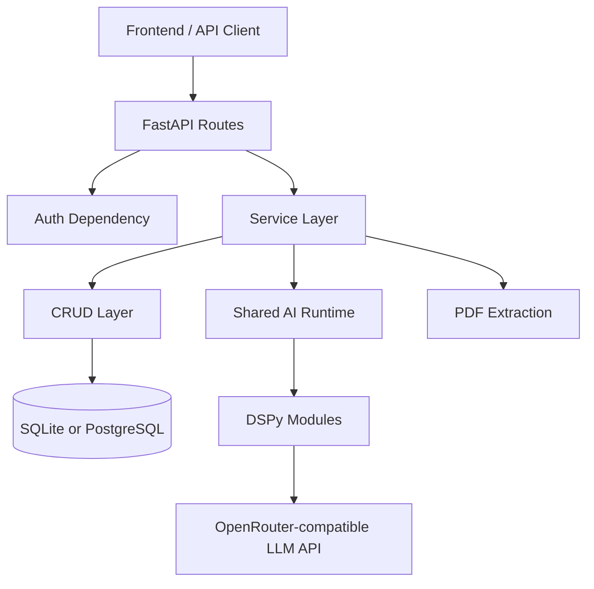
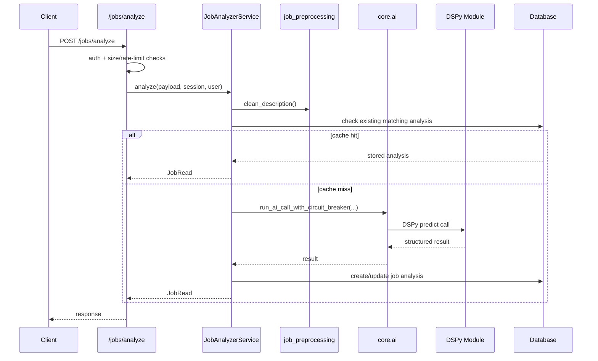

# JOBPI System Documentation

## Purpose

This document is the backend and AI-system source of truth for JOBPI as implemented in this repository.
It is intended for developers and AI agents who need to understand, modify, extend, or debug the system safely.

It documents what exists in code today. Where behavior is inferred from naming, tests, or adjacent code rather than from an explicit implementation contract, that is called out as an assumption.

## 1. System Overview

### What JOBPI does

JOBPI is an AI-assisted job application backend with authenticated, user-scoped workflows for:

- Registering and authenticating users
- Uploading and managing CVs
- Extracting and cleaning PDF resume text
- Generating compact CV library summaries
- Analyzing job descriptions into structured guidance
- Matching a CV against a job
- Comparing two CVs for a job
- Generating tailored cover letters
- Tracking saved/applied job states and notes

The backend is built with FastAPI and SQLModel. AI generation is handled through DSPy configured against an OpenRouter-compatible chat completion endpoint.

### Core user workflows

#### CV upload flow

1. Authenticated user uploads a PDF to `POST /cvs/upload` or `POST /cvs/batch-upload`.
2. The route validates rate limits, request size, PDF MIME type, and file size.
3. `CvLibraryService.upload_cv()` extracts PDF text, preprocesses it, deduplicates by normalized `clean_text`, generates a compact library summary, and stores the CV.
4. The API returns a `CVRead` payload.

#### Job analysis flow

1. Authenticated user sends title, company, and description to `POST /jobs/analyze`.
2. The route validates size and rate limits.
3. `JobAnalyzerService.analyze()` cleans and prunes the job description, checks DB and in-memory caches, then runs a DSPy module through the shared AI execution wrapper.
4. The result is normalized into a stable `JobAnalysisPayload` and stored as a `JobAnalysis`.
5. If the AI path fails, a heuristic fallback analysis is produced instead of failing hard.

#### CV match flow

1. Authenticated user requests `POST /jobs/{job_id}/match-cvs`.
2. `CvLibraryService.match_job_to_cv()` loads the job and CV, checks for an existing stored match, and runs AI only when needed or when `regenerate=true`.
3. `CvAnalyzerService` compares a pruned job excerpt and a pruned CV excerpt.
4. The result is persisted as a `CVJobMatch`.
5. The API returns both the stored match fields and the richer AI analysis payload.

#### Cover letter flow

1. Authenticated user requests `POST /jobs/{job_id}/cover-letter`.
2. `CoverLetterService.generate_cover_letter()` loads the job and chosen CV, checks for a stored cached cover letter for that exact job/CV/language pair, and only regenerates when needed.
3. The service builds a pruned job excerpt and a targeted CV excerpt, then generates a short plain-text cover letter through DSPy.
4. On failure, a heuristic cover letter is returned.
5. The generated cover letter is stored on the `JobAnalysis` row along with the CV and language used.

## 2. Architecture

### High-level backend structure

```text
app/
├─ main.py                  FastAPI app creation, middleware, exception handling
├─ api/routes/              HTTP endpoints
├─ dependencies/            Dependency injection helpers
├─ core/                    Settings, AI runtime, logging, security, rate limiting
├─ db/                      Engine, sessions, migrations, CRUD layer
├─ models/                  SQLModel ORM entities
├─ schemas/                 Request/response models
└─ services/                Business logic and AI orchestration
```

### Separation of concerns

#### Routes

- Handle HTTP shape only
- Enforce endpoint-specific rate limits and payload size limits
- Convert internal exceptions into FastAPI `HTTPException`s when needed
- Delegate all business logic to services

#### Services

- Contain the application behavior
- Orchestrate CRUD, AI calls, preprocessing, normalization, and fallbacks
- Keep API response contracts stable even when the AI path fails

#### Core

- `settings.py`: environment loading, defaults, runtime validation, DSPy configuration
- `ai.py`: shared AI execution wrapper, timeout handling, observability, provider error classification
- `circuit_breaker.py`: retry orchestration with backoff and attempt-aware token budgets
- `security.py`: password hashing and JWT handling
- `rate_limit.py` and `rate_limit_redis.py`: request throttling
- `logging.py`: request/user context enrichment and JSON/plain structured logging

#### DB layer

- `models/entities.py`: SQLModel tables and relationships
- `db/crud.py`: DB reads and writes
- `db/database.py`: engine and session creation
- `db/migration_runner.py`: startup migration orchestration

### Component interaction



## 3. AI System

This is the most important subsystem in JOBPI. The AI layer is deliberately narrow: only a few services call the model, and each call is wrapped with shared timeout, retry, logging, and fallback behavior.

### Where AI is used

AI is invoked in four places:

1. `app/services/job_analyzer.py`
   - Structured job analysis from a job description
2. `app/services/cv_analyzer.py`
   - Structured CV-vs-job fit analysis
3. `app/services/cover_letter_service.py`
   - Cover letter generation
4. `app/services/cv_library_summary_service.py`
   - Compact CV library summary generation

There is no retrieval, vector database, embeddings pipeline, reranker, or RAG system in the backend code.

### DSPy model setup

`app/core/settings.py` creates a single shared DSPy LM in `configure_dspy()`:

- Provider base URL: `OPENROUTER_BASE_URL`
- API key: `OPENROUTER_API_KEY`
- Model: `DSPY_MODEL`
- Temperature: clamped between `0.2` and `0.4`
- Default max tokens: `MAX_OUTPUT_TOKENS`
- Extra body: reasoning explicitly disabled

Important implications:

- DSPy is used as a lightweight structured prompting abstraction, not as a training or optimization system.
- The backend relies on `dspy.Predict(...)` signatures to shape outputs.
- Per-call token overrides are done with `dspy_lm_override()` instead of reconfiguring the global LM.

### Shared AI execution path

All major AI calls go through:

- `run_ai_call_with_circuit_breaker()` in `app/core/ai.py`
- `AICircuitBreaker.call()` in `app/core/circuit_breaker.py`
- `run_ai_call_with_timeout()` in `app/core/ai.py`

This gives each call:

- Executor-backed timeout enforcement
- Structured observability logs
- Retry with exponential backoff
- Attempt-aware token budget reduction
- Provider/auth error classification

### Retry behavior

Retries are conservative:

- Authentication-style errors are not retried.
- HTTP 502, 503, and 504 are retryable.
- Connection/provider-unavailable style failures are retryable.
- Retries use a smaller token budget when `retry_lm_max_tokens` is supplied.

This is important in `JobAnalyzerService`, where retry attempts use:

- Smaller prompt context
- `job_analysis_retry_max_tokens` instead of the full initial budget

### Observability and AI logs

The AI runtime emits consistent logs such as:

- `ai_call_start`
- `ai_call_complete`
- `ai_timeout`
- `ai_output_truncated`
- `ai_retry`
- `ai_circuit_open`
- `ai_cache ...`
- `ai_fallback ...`

Captured fields include:

- `operation`
- `retry_count`
- `max_tokens`
- estimated input chars/tokens
- latency
- provider usage tokens when available
- truncation warnings
- cache hit/miss source

### Prompt structure and DSPy signatures

The system uses DSPy `Signature` classes rather than raw string templates stored in separate files.
Each service defines its own schema and field-level instructions.

#### Job analysis signature

`LeanJobAnalysisSignature` asks for:

- summary
- seniority
- role type
- required skills
- nice-to-have skills
- responsibilities
- prep actions
- learning priorities
- likely gaps
- resume tips
- interview tips
- project ideas

The signature is optimized for:

- explicit evidence from the posting
- concise actionable outputs
- no filler
- no long copied job-description fragments

#### CV fit signature

`CvFitSignature` compares:

- job title
- pruned job excerpt
- pruned CV excerpt
- target language

It returns:

- fit summary
- strengths
- missing skills
- likely fit level
- resume improvements
- interview focus
- next steps

The wording is intentionally conservative to avoid inflated fit claims.

#### Cover letter signature

`CoverLetterSignature` takes:

- job title
- company
- pruned job excerpt
- CV summary
- pruned CV excerpt
- response language

It returns:

- one plain-text cover letter with greeting, 2-3 short paragraphs, and sign-off

The prompt explicitly discourages:

- unsupported claims
- filler
- flattery
- repetition

#### CV library summary signature

`CvLibrarySummarySignature` produces:

- 1-2 short complete sentences
- role focus
- seniority only if obvious
- representative technologies/domains only when evidenced

This is used to keep CV cards informative without storing long summaries.

### Preprocessing and context pruning

AI quality in JOBPI depends heavily on deterministic preprocessing, especially because the system tries to reduce tokens without weakening output usefulness.

#### Job preprocessing

`app/services/job_preprocessing.py` contains the shared context-building logic.

Key functions:

- `clean_description(text)`
- `build_job_excerpt(text, max_chars=None)`
- `build_cv_excerpt(cv_text, summary=None, library_summary=None, job_description=None, max_chars=None)`
- `build_context_fingerprint(...)`
- `estimate_text_tokens(...)`
- `estimate_payload_tokens(...)`

Job text optimization behavior:

- Normalize whitespace and lines
- Remove obvious boilerplate/noise:
  - EEO
  - diversity/culture copy
  - benefits/perks/compensation text
  - company boilerplate
- Detect section headings:
  - requirements
  - responsibilities
  - preferred skills
  - role overview
  - skills/tools/stack
  - experience/background
- Score and preserve higher-signal lines first
- Truncate conservatively at meaningful boundaries

#### CV preprocessing

CV context optimization combines two layers:

1. `pdf_extractor.py` produces `clean_text`
2. `job_preprocessing.py` builds a smaller AI excerpt from that text

`pdf_extractor.py`:

- validates the `%PDF` magic bytes
- extracts text with `pypdf` if available
- falls back to `fitz`/PyMuPDF if `pypdf` is unavailable
- removes contact information
- merges wrapped lines
- filters filler lines and very short lines
- prioritizes skills, experience, projects, and useful education lines
- truncates the final CV text to configured limits

`build_cv_excerpt()` then further shrinks the prompt context by favoring:

- summary/library summary lines
- skills
- recent experience
- projects
- quantified/action-oriented lines
- lines matching role keywords extracted from the job

### Token optimization strategies

The AI layer already includes several conservative optimization strategies:

1. Smaller high-signal context instead of full raw text
2. Different token budgets per task
3. Cheaper retry budgets for job analysis
4. Pruned cover-letter inputs
5. Pruned CV match inputs
6. Versioned context fingerprints to keep caches safe after prompt/context changes

Current notable token controls in `Settings`:

- `MAX_OUTPUT_TOKENS`
- `JOB_ANALYSIS_MAX_TOKENS`
- `JOB_ANALYSIS_RETRY_MAX_TOKENS`
- `CV_MATCH_MAX_TOKENS`
- `COVER_LETTER_MAX_TOKENS`
- `JOB_PREPROCESS_TARGET_CHARS`
- `MAX_JOB_DESCRIPTION_CHARS`
- `MAX_CV_TEXT_CHARS`
- `AI_TIMEOUT_SECONDS`

### Caching and reuse

The system uses both persistence-layer reuse and in-memory reuse.

#### Job analysis caching

`JobAnalyzerService` checks:

1. DB cache:
   - same user
   - same title
   - same company
   - same cleaned description
   - same language
2. In-memory cache:
   - keyed with `build_context_fingerprint("job_analysis", ...)`

#### CV match caching

`CvLibraryService` reuses:

- stored `CVJobMatch` rows as the primary cache
- an in-memory `_analysis_cache` keyed by:
  - `CONTEXT_BUILDER_VERSION`
  - user_id
  - job_id
  - cv_id
  - language

#### Cover letter caching

Cover letters are cached on the `JobAnalysis` row and reused when:

- the same job is requested
- the same CV is selected
- the same language is requested
- `regenerate` is false

#### CV library summary caching

CV summaries are effectively cached in the DB on the `CV.library_summary` field.
The summary service is intentionally created fresh per upload to avoid accidental stale in-memory reuse across batch uploads.

### Failure handling and fallback logic

The system is designed to degrade gracefully.

#### Authentication/configuration failures

If the AI provider is not configured correctly, the system usually responds with:

- `503 AI analysis is not configured`

This is derived from auth-like provider errors via `looks_like_ai_auth_error()`.

#### Provider/network instability

Provider-unavailable conditions are mapped to:

- retry attempts when safe
- `503` or `502` when retries are exhausted

#### Heuristic fallbacks

Each major AI path has a fallback:

- `JobAnalyzerService` builds a structured fallback from extracted skills and actionable job lines.
- `CvAnalyzerService` computes matched/missing keyword signals and synthesizes a fit summary.
- `CoverLetterService` builds a short deterministic cover letter from shared job/CV keywords.
- `CvLibrarySummaryService` generates a heuristic one-line summary from role/seniority/technology detection.

Design goal:

- preserve product continuity even when the LLM path is unavailable
- keep response shape stable
- prefer weaker-but-useful answers over hard failures in user-facing workflows

## 4. Services Breakdown

This section documents each backend service/module and the main core modules that behave like services.

### `app/services/job_analyzer.py`

#### Responsibility

Analyze a job description into a structured `JobAnalysisPayload` and persist or reuse the result.

#### Inputs

- `JobAnalysisRequest`
  - title
  - company
  - description
  - language
  - regenerate

#### Outputs

- `JobRead`

#### Internal logic

1. Clean the job description with `clean_description()`
2. Normalize response language
3. Build versioned cache key
4. Build a smaller retry excerpt
5. Check DB cache, then memory cache
6. Call DSPy module through shared AI runtime
7. Normalize all text/list fields
8. Persist or update `JobAnalysis`
9. Fallback to heuristic payload on failure

#### Dependencies

- `configure_dspy()`
- `run_ai_call_with_circuit_breaker()`
- CRUD functions
- `job_preprocessing.py`
- `response_language.py`

#### Side effects

- Writes to `job_analyses`
- Writes to in-memory cache
- Emits AI/cache/fallback logs

### `app/services/cv_analyzer.py`

#### Responsibility

Generate structured CV-vs-job fit analysis from a job description and CV text.

#### Inputs

- job title
- job description
- CV text
- language

#### Outputs

- `CvAnalysisResponse`

#### Internal logic

1. Normalize language
2. Build a pruned job excerpt
3. Build a pruned CV excerpt based on the job
4. Run DSPy through the shared AI runtime
5. Normalize the response
6. Fallback to deterministic keyword-based analysis on failure

#### Dependencies

- `build_job_excerpt()`
- `build_cv_excerpt()`
- `run_ai_call_with_circuit_breaker()`

#### Side effects

- Emits timing and fallback logs
- Does not persist by itself

### `app/services/cover_letter_service.py`

#### Responsibility

Generate or reuse a concise cover letter for a specific job and CV.

#### Inputs

- DB session
- user
- job id
- selected CV id
- language
- regenerate flag

#### Outputs

- plain-text cover letter string

#### Internal logic

1. Load job and CV with user scoping
2. Reuse stored cover letter when possible
3. Build pruned job excerpt
4. Prefer `library_summary` or `summary` plus a targeted CV excerpt instead of the full CV
5. Run DSPy through the shared AI runtime
6. Normalize the generated text to 2-3 short paragraphs
7. Fallback to deterministic templated text on failure
8. Store the generated cover letter on the job

#### Dependencies

- CRUD
- `build_job_excerpt()`
- `build_cv_excerpt()`
- `run_ai_call_with_circuit_breaker()`

#### Side effects

- Updates `generated_cover_letter`, `cover_letter_cv_id`, and `cover_letter_language`

### `app/services/cv_library_service.py`

#### Responsibility

Own the CV library workflow and higher-level matching/comparison behavior.

#### Inputs

- Upload inputs: display name, filename, PDF bytes
- CV management inputs: ids, tags, favorite toggle
- Match/compare inputs: job id, CV ids, language, regenerate

#### Outputs

- `CVRead`
- `CVDetailRead`
- `CVJobMatchRead`
- `CVJobMatchDetailRead`
- `CVComparisonResponse`
- bulk action summaries

#### Internal logic

Major responsibilities:

- Upload and dedupe CVs
- Ensure `library_summary` exists
- Manage tags and favorites
- Match one job to one CV
- Compare two CVs for a job
- Match a job to all CVs
- Turn stored match records into richer API payloads

Important behavior:

- Dedupes CV uploads by `clean_text`
- Stores `summary` and `library_summary` as the same initial compact summary
- Reuses stored matches unless `regenerate=true`
- Computes an additional heuristic overlap score
- Uses heuristic score as the deterministic tie-breaker and recommendation anchor

#### Dependencies

- CRUD
- `pdf_extractor.py`
- `cv_library_summary_service.py`
- `cv_analyzer.py`
- `response_language.py`

#### Side effects

- Creates/updates/deletes CVs and matches
- Updates library summaries
- Writes to in-memory analysis cache

### `app/services/cv_library_summary_service.py`

#### Responsibility

Generate a short CV card summary suitable for list views.

#### Inputs

- cleaned CV text

#### Outputs

- short summary string

#### Internal logic

1. Build a compact CV context limited to representative complete lines
2. Run a DSPy summary module with caching disabled at the LM call level
3. Normalize summary text
4. Fallback to heuristic role/seniority/technology detection if generation fails

#### Dependencies

- DSPy config
- shared AI runtime
- role/seniority/technology regexes

#### Side effects

- Logging only
- Persistence happens in `CvLibraryService`

### `app/services/job_preprocessing.py`

#### Responsibility

Provide deterministic text cleaning, pruning, scoring, token estimation, and versioned fingerprints for AI contexts.

#### Inputs

- raw job text
- raw CV text
- optional summary strings
- optional job context

#### Outputs

- cleaned job description
- pruned job excerpt
- pruned CV excerpt
- estimated token counts
- versioned fingerprint hashes

#### Internal logic

- noise removal
- heading detection
- per-line scoring
- deduplication
- conservative truncation

#### Side effects

- None

### `app/services/pdf_extractor.py`

#### Responsibility

Extract and clean text from uploaded PDF resumes.

#### Inputs

- raw PDF bytes

#### Outputs

- raw extracted text
- cleaned/truncated CV text

#### Internal logic

- PDF signature validation
- `pypdf` extraction first
- `fitz` fallback
- contact stripping
- wrapped-line repair
- high-value section selection
- truncation

#### Side effects

- Logging only

### `app/services/response_language.py`

#### Responsibility

Centralize language normalization and localized helper text used in match explanations and AI instructions.

#### Inputs / Outputs

- normalize `"english"` / `"spanish"`
- language instruction strings
- localized explanation snippets

### `app/core/ai.py`

#### Responsibility

Provide a shared runtime for safe AI execution.

#### Key functions

- `dspy_lm_override()`
- `run_ai_call_with_timeout()`
- `run_ai_call_with_circuit_breaker()`
- `build_ai_failure_http_exception()`
- `looks_like_ai_auth_error()`

#### Side effects

- AI observability logging
- timeout conversion into HTTP errors

### `app/core/circuit_breaker.py`

#### Responsibility

Retry retryable AI calls with backoff and token-budget awareness.

#### Side effects

- Emits `ai_retry` and `ai_circuit_open` logs

### `app/core/security.py`

#### Responsibility

- Hash passwords with PBKDF2-HMAC-SHA256
- Verify passwords
- Issue JWTs
- Decode JWTs

#### Important note

If `PyJWT` is unavailable, the code falls back to a local HS256 JWT implementation.

### `app/core/rate_limit.py` and `app/core/rate_limit_redis.py`

#### Responsibility

Apply per-route rate limiting.

#### Behavior

- In-memory limiter by default
- Redis-backed limiter when `REDIS_URL` is set
- Fallback to in-memory if Redis initialization or requests fail
- Trusted user can bypass limits

### `app/core/logging.py`

#### Responsibility

Provide structured logging with request/user context propagation.

#### Behavior

- Binds `trace_id`, path, method, and `user_id`
- Writes to stdout
- Uses JSON formatting when `python-json-logger` is installed

### `app/core/validation.py`

#### Responsibility

Reject oversized requests early using `Content-Length`.

### `app/core/runtime.py`

#### Responsibility

Set `DSPY_CACHEDIR` automatically on Vercel when needed.

## 5. Data Flow

### Request lifecycle

Every request passes through the same app-level infrastructure in `app/main.py`:

1. Assign a `trace_id`
2. Bind request/user logging context
3. Log `request_start`
4. Enforce a global 10 MB request-size guard
5. Execute the route
6. Log response size warnings when needed
7. Log `request_end`
8. Return `X-Trace-Id`

### Example: job analysis request flow



### Example: CV upload flow

1. Route accepts multipart file upload.
2. Request size and PDF size are validated.
3. `CvLibraryService.upload_cv()` extracts raw text.
4. `preprocess_cv_text()` builds `clean_text`.
5. Duplicate CVs are detected by `clean_text`.
6. `CvLibrarySummaryService.generate()` creates the short summary.
7. CV is persisted and returned.

### Where transformations happen

- Raw job description -> `clean_description()` -> pruned excerpts
- Raw PDF -> extracted raw text -> `preprocess_cv_text()` -> stored `clean_text`
- Stored match rows -> enriched explanation payloads in `CvLibraryService`
- AI outputs -> normalized strings/lists before persistence or response

## 6. Database and Models

### Entities

#### `User`

- `id`
- `email`
- `hashed_password`
- `is_active`
- `created_at`

Relationships:

- one-to-many with `CV`
- one-to-many with `JobAnalysis`
- one-to-many with `CVJobMatch`

#### `CV`

- `id`
- `user_id`
- `filename`
- `display_name`
- `raw_text`
- `clean_text`
- `summary`
- `library_summary`
- `is_favorite`
- `tags` as JSON/JSONB array
- `created_at`

#### `JobAnalysis`

- `id`
- `user_id`
- `title`
- `company`
- `description`
- `clean_description`
- `analysis_result` as JSON/JSONB
- `is_saved`
- `status`
- `applied_date`
- `notes`
- `generated_cover_letter`
- `cover_letter_cv_id`
- `cover_letter_language`
- `created_at`

#### `CVJobMatch`

- `id`
- `user_id`
- `cv_id`
- `job_id`
- `fit_level`
- `fit_summary`
- `strengths` as JSON/JSONB
- `missing_skills` as JSON/JSONB
- `recommended`
- `created_at`

### Relationships and constraints

- `CVJobMatch` is unique on `(user_id, cv_id, job_id)`
- `JobAnalysis.status` is constrained to:
  - `saved`
  - `applied`
  - `interview`
  - `rejected`
  - `offer`
- PostgreSQL migrations also add:
  - lowercased unique email index
  - at-most-one recommended match per job
  - hash-based dedupe indexes for CV/job text

### CRUD patterns

The CRUD layer is explicit and imperative.
It does not hide SQLModel/SQLAlchemy semantics behind a repository abstraction.

Notable patterns:

- user-scoped reads everywhere
- DB-side or app-side tag filtering depending on backend
- PostgreSQL hash indexes for dedupe lookups
- cleanup of dependent rows before deleting jobs/CVs

## 7. Integrations

### OpenRouter-compatible LLM API

Used through DSPy `dspy.LM(...)`.

Environment variables:

- `OPENROUTER_API_KEY`
- `OPENROUTER_BASE_URL`
- `DSPY_MODEL`
- `DSPY_TEMPERATURE`

### DSPy

Used as the structured prompting layer.

It is responsible for:

- schema-driven prompting
- field-based output collection
- LM context switching through `dspy.context()`

### Database

The backend supports:

- SQLite for zero-config local development
- PostgreSQL for production

README and `.env.example` reference Supabase PostgreSQL as a recommended production host, but the backend itself integrates only through a standard `DATABASE_URL`. There is no direct Supabase SDK usage in the Python backend.

### Redis

Optional.
Used only for shared rate limiting when `REDIS_URL` is configured.

### Sentry

Optional.
Initialized in `app/main.py` when `SENTRY_DSN` is present.
Used for unhandled exception capture with request and user context.

### PDF extraction libraries

- Primary: `pypdf`
- Fallback: `fitz` / PyMuPDF if installed

## 8. Configuration

### Important environment variables

#### Core runtime

- `APP_ENV`
- `DATABASE_URL`
- `SECRET_KEY`
- `ACCESS_TOKEN_EXPIRE_MINUTES`
- `FRONTEND_URL`
- `CORS_ORIGINS`
- `CORS_ORIGIN_REGEX`
- `CORS_MAX_AGE_SECONDS`

#### AI

- `OPENROUTER_API_KEY`
- `OPENROUTER_BASE_URL`
- `DSPY_MODEL`
- `DSPY_TEMPERATURE`
- `MAX_OUTPUT_TOKENS`
- `JOB_ANALYSIS_MAX_TOKENS`
- `JOB_ANALYSIS_RETRY_MAX_TOKENS`
- `CV_MATCH_MAX_TOKENS`
- `COVER_LETTER_MAX_TOKENS`
- `JOB_PREPROCESS_TARGET_CHARS`
- `AI_TIMEOUT_SECONDS`

#### Limits and uploads

- `MAX_PDF_SIZE_MB`
- `MAX_CVS_PER_UPLOAD`
- `MAX_JOB_DESCRIPTION_CHARS`
- `MAX_CV_TEXT_CHARS`

#### Rate limiting

- `RATE_LIMIT_ENABLED`
- `AUTH_RATE_LIMIT_WINDOW_SECONDS`
- `AUTH_REGISTER_RATE_LIMIT`
- `AUTH_LOGIN_RATE_LIMIT`
- `JOB_ANALYZE_RATE_LIMIT_WINDOW_SECONDS`
- `JOB_ANALYZE_RATE_LIMIT`
- `MATCH_CVS_RATE_LIMIT_WINDOW_SECONDS`
- `MATCH_CVS_RATE_LIMIT`
- `COVER_LETTER_RATE_LIMIT_WINDOW_SECONDS`
- `COVER_LETTER_RATE_LIMIT`
- `CV_UPLOAD_RATE_LIMIT_WINDOW_SECONDS`
- `CV_UPLOAD_RATE_LIMIT`
- `REDIS_URL`
- `TRUSTED_USER_EMAIL`

#### Observability

- `SENTRY_DSN`

### Development vs production behavior

`Settings` contains environment-specific defaults.

Development defaults:

- rate limiting disabled
- larger upload/text limits
- longer AI timeouts
- larger token budgets
- SQLite allowed

Production defaults:

- rate limiting enabled
- smaller upload/text limits
- shorter AI timeouts
- tighter token budgets
- PostgreSQL required
- strong `SECRET_KEY` required

## 9. Known Issues, Limitations, and Risk Areas

This section documents current constraints visible from the codebase.

### 1. AI fallback quality is intentionally lower than model quality

The heuristic fallbacks preserve continuity, not parity.
They are useful safety nets but are simpler and less nuanced than the DSPy outputs.

### 2. In-memory caches are process-local

`JobAnalyzerService` and `CvLibraryService` use process memory caches.
These do not survive restarts and are not shared across instances.
The durable cache layer is the database.

### 3. Cover-letter caching is stored per job row

Only one cached cover letter is stored per job at a time:

- one selected CV id
- one language
- one generated body

Regenerating for a different CV/language overwrites the previous cached cover-letter fields for that job row.

### 4. Matching recommendation logic mixes AI and heuristics

Final comparison/recommendation decisions are intentionally stabilized by heuristic overlap scores.
This helps determinism, but it also means recommendation ranking is not purely AI-driven.

### 5. PDF extraction depends on installed libraries and text-based PDFs

Scanned/image-only PDFs are not supported by OCR in the backend.
If text extraction fails, the upload fails with a validation-style error.

### 6. Rate limiting fallback can become instance-local

When Redis is unavailable, the limiter falls back to in-memory.
That preserves service availability but weakens global cross-instance consistency.

### 7. No asynchronous task queue

All AI and PDF work is performed in request-time flows.
This is simpler operationally but can increase latency and request coupling.

### 8. No explicit prompt version registry

Prompt/context changes are partially versioned through `CONTEXT_BUILDER_VERSION`, but there is no full prompt-version system stored in the database.

### 9. No direct OCR, no RAG, no semantic search

These are not bugs, but they are functional boundaries worth knowing before proposing changes.

## 10. Extensibility Guide

This section explains how to change the system safely.

### How to add a new AI feature

Recommended pattern:

1. Add a dedicated service in `app/services/`
2. Define a small DSPy `Signature`
3. Keep inputs narrow and high-signal
4. Reuse `run_ai_call_with_circuit_breaker()`
5. Add deterministic fallback behavior if the feature is user-facing
6. Add or reuse schema models in `app/schemas/`
7. Add route-level validation and rate limiting if exposed over HTTP
8. Add tests for:
   - happy path
   - fallback path
   - cache behavior if applicable
   - output normalization

### How to modify prompts safely

Use this checklist:

1. Prefer changing `Signature` docstrings and field descriptions over introducing long raw prompts.
2. Keep instructions specific and evidence-based.
3. Avoid asking for information the context builder no longer sends.
4. Preserve output shapes and field semantics.
5. Update `CONTEXT_BUILDER_VERSION` if the meaning of cached prompt/context inputs changes materially.
6. Run AI workflow tests after changes.

### How to add a new service

Recommended structure:

1. Add a service module in `app/services/`
2. Keep routes thin and delegate into the service
3. Use schemas for request/response contracts
4. Use CRUD functions for persistence rather than embedding SQL in routes
5. Add logging around expensive or failure-prone operations

### How to extend existing flows safely

#### CV upload flow

- Keep `upload_cv()` deterministic before persistence
- Preserve dedupe by `clean_text`
- Be careful not to inflate stored `clean_text` with low-signal text
- Do not remove the heuristic summary fallback unless you replace it with something equally reliable

#### Job analysis flow

- Preserve response field names in `JobAnalysisPayload`
- Be careful with retry budgets and prompt context size
- If prompt/context semantics change, invalidate memory caches through fingerprint versioning

#### Match flow

- Preserve stable match response contracts
- Remember that stored `CVJobMatch` rows are both data and cache
- Keep comparison logic deterministic for repeatability

#### Cover-letter flow

- Preserve the output contract:
  - plain text
  - 2-3 short paragraphs
  - sign-off
- Avoid sending the full CV unless there is a clear quality gain

## 11. Best Practices for Future Changes

### Do

- Keep routes thin
- Keep AI calls inside service modules
- Reuse `run_ai_call_with_circuit_breaker()` for new model calls
- Prefer deterministic preprocessing over broad summarization
- Keep response schemas stable
- Add fallbacks for user-facing AI features
- Use DB-backed reuse before adding more complex caches
- Keep observability structured and machine-readable

### Do not

- Do not add raw full-text prompts when excerpt builders already exist
- Do not bypass user-scoped CRUD access patterns
- Do not move AI calls directly into route handlers
- Do not replace deterministic fallbacks with hard failures unless product requirements change
- Do not assume PostgreSQL-only features are available in SQLite code paths
- Do not add semantic caching, RAG, or embeddings unless a real product need exists

## 12. API Surface Summary

### Auth

- `POST /auth/register`
- `POST /auth/login`
- `GET /auth/me`

### CVs

- `POST /cvs/upload`
- `POST /cvs/batch-upload`
- `GET /cvs`
- `GET /cvs/{cv_id}`
- `PATCH /cvs/{cv_id}/tags`
- `PATCH /cvs/{cv_id}/toggle-favorite`
- `POST /cvs/bulk-delete`
- `POST /cvs/bulk-tag`
- `DELETE /cvs/{cv_id}`

### Jobs

- `POST /jobs/analyze`
- `GET /jobs`
- `GET /jobs/{job_id}`
- `DELETE /jobs/{job_id}`
- `PATCH /jobs/{job_id}/status`
- `PATCH /jobs/{job_id}/notes`
- `PATCH /jobs/{job_id}/toggle-saved`
- `POST /jobs/{job_id}/match-cvs`
- `POST /jobs/{job_id}/compare-cvs`
- `POST /jobs/{job_id}/cover-letter`

### Matches

- `GET /matches`
- `GET /matches/{match_id}`

### Utility

- `GET /health`

## 13. Fast Debugging Guide

### If job analysis quality regresses

Check in this order:

1. `app/services/job_preprocessing.py`
2. `LeanJobAnalysisSignature`
3. token settings in `Settings`
4. AI logs:
   - `ai_call_start`
   - `ai_call_complete`
   - `ai_output_truncated`
   - `ai_fallback`
   - `ai_retry`

### If CV uploads fail

Check:

1. file size and MIME validation in `app/api/routes/cvs.py`
2. PDF extraction backend availability in `app/services/pdf_extractor.py`
3. whether the PDF is text-based rather than scanned
4. whether preprocessing over-trimmed the text

### If cover letters seem generic

Check:

1. `build_job_excerpt()`
2. `build_cv_excerpt()`
3. `CoverLetterSignature`
4. `cover_letter_max_tokens`
5. whether a cached cover letter is being reused unexpectedly

### If rate limiting behaves inconsistently in production

Check:

1. `RATE_LIMIT_ENABLED`
2. `REDIS_URL`
3. logs for `rate_limiter_backend`
4. logs for `redis_rate_limit_unavailable`

### If authentication breaks

Check:

1. `SECRET_KEY`
2. token creation/validation in `app/core/security.py`
3. `get_current_user()` in `app/dependencies/auth.py`
4. whether legacy email-subject tokens are still involved

## 14. Summary

JOBPI’s backend architecture is intentionally straightforward:

- FastAPI routes for transport
- service layer for business logic
- CRUD layer for persistence
- DSPy-based AI modules behind a shared execution wrapper
- deterministic preprocessing and heuristic fallbacks to keep the product reliable

The core architectural theme is conservative AI integration:

- narrow AI entry points
- strong preprocessing
- stable response shapes
- caching before re-computation
- bounded retries
- observable behavior
- graceful degradation

That makes the system relatively easy to extend as long as new work follows the same pattern instead of bypassing it.
